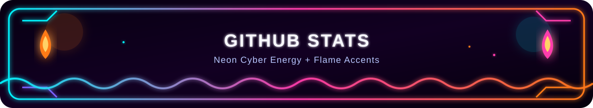

 

 

## 🚀 About Me

> **IT Support today. Building toward Software Development and AI.**

I work in **IT Support**, where I troubleshoot systems and solve real technical problems. Outside of work, I enjoy turning repetitive tasks and ideas into **code, automation, backend services, and practical AI-powered tools**.

- 🛠️ Working with **IT systems, troubleshooting, and technical support**
- 💻 Building personal projects to improve my **software development skills**
- ⚙️ Exploring **automation, backend development, and REST APIs**
- 🤖 Experimenting with practical **AI applications**
- 🎯 Goal: combine real-world IT experience with **Software Development + AI**

  
  
  

## 🛠️ Tech Stack

  

  <strong>LANGUAGES</strong>&nbsp;&nbsp; Python · Java · JavaScript · TypeScript
   
  <strong>BUILD</strong>&nbsp;&nbsp; React · Node.js · Tauri · HTML · CSS
   
  <strong>TOOLS</strong>&nbsp;&nbsp; Git · GitHub · VS Code
   
  <strong>FOCUS</strong>&nbsp;&nbsp; REST APIs · Automation · AI

## 📌 Featured Projects

  <strong>SELECTED BUILDS</strong>&nbsp;&nbsp;//&nbsp;&nbsp;WEB · DESKTOP · PERSONAL
    
  
  
  

## 📊 GitHub Dashboard

  

  

  
  

  
  

  <strong>ACHIEVEMENTS</strong>&nbsp;&nbsp;·&nbsp;&nbsp;Milestones unlocked
    
  
  

  

## 🧩 Contributions

  

