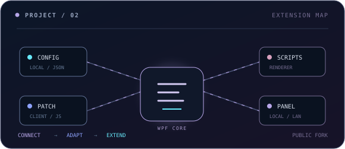
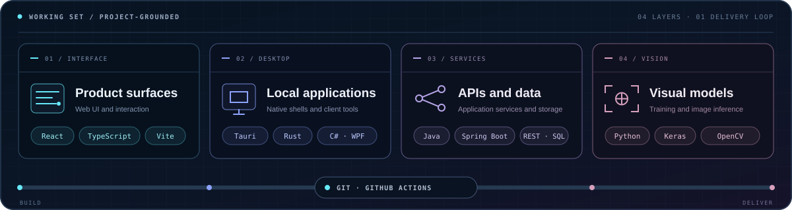

  

## A support mindset, applied to software

I currently work in **IT Support**. It keeps me close to the small frictions that show up in real workflows: repeated clicks, awkward handoffs, and tools that almost fit. I am going deeper into software development by building web apps, desktop tools, REST APIs, and automations—with AI as another practical tool to explore.

### Current loop

> **01 / Notice** a repetitive problem &nbsp;→&nbsp; **02 / Build** the smallest useful fix 
> **03 / Test** it in a real workflow &nbsp;→&nbsp; **04 / Simplify** the next version

## Selected work

<table>
  <tr>
    <td width="50%" valign="top">
      
      <h3><a href="https://github.com/hungdeniubeo/Schedulework">Schedulework</a></h3>
      
An offline desktop shift planner with drag-and-drop assignment, overlap checks, editable staffing totals, and JPG export. Schedule data stays on the device.

      
<code>Tauri 2</code> <code>React</code> <code>TypeScript</code> <code>Rust</code>

    </td>
    <td width="50%" valign="top">
      
      <h3><a href="https://github.com/hungdeniubeo/Wand-Enhancer">Wand Enhancer</a></h3>
      
A public fork of an open-source .NET interoperability tool for local Wand configuration, client-side extensions, and an optional remote web panel.

      
<code>C#</code> <code>.NET 4.8</code> <code>WPF</code> <code>Preact</code> <code>TypeScript</code>

    </td>
  </tr>
  <tr>
    <td width="50%" valign="top">
      
      <h3><a href="https://github.com/hungdeniubeo/Busbooking">Busbooking</a></h3>
      
A full-stack bus booking project with a React/Vite client and a Java Spring Boot REST backend. The code includes JWT authentication and booking domain models.

      
<code>React</code> <code>Vite</code> <code>Java</code> <code>Spring Boot</code> <code>MySQL</code>

    </td>
    <td width="50%" valign="top">
      
      <h3><a href="https://github.com/hungdeniubeo/Traffic-sign">Traffic Sign</a></h3>
      
A CNN-based German traffic-sign recognition project trained on GTSRB, with image and webcam inference plus saved evaluation artifacts.

      
<code>Python</code> <code>Keras</code> <code>OpenCV</code> <code>scikit-learn</code>

    </td>
  </tr>
</table>

## Working set

The tools behind the projects above, grouped by where they sit in the system.

  <picture>
    <source media="(max-width: 640px)" srcset="./assets/toolbox-system-mobile.svg" />
    
  </picture>

## Proof of work

  <picture>
    <source media="(prefers-color-scheme: dark)" srcset="https://raw.githubusercontent.com/hungdeniubeo/hungdeniubeo/output/profile-3d-contrib/profile-night-view.svg" />
    <source media="(prefers-color-scheme: light)" srcset="https://raw.githubusercontent.com/hungdeniubeo/hungdeniubeo/output/profile-3d-contrib/profile-season.svg" />
    
  </picture>

  
<strong>Open the contribution trail</strong>

   
  <picture>
    <source media="(prefers-color-scheme: dark)" srcset="https://raw.githubusercontent.com/hungdeniubeo/hungdeniubeo/output/github-contribution-grid-snake-dark.svg" />
    <source media="(prefers-color-scheme: light)" srcset="https://raw.githubusercontent.com/hungdeniubeo/hungdeniubeo/output/github-contribution-grid-snake.svg" />
    
  </picture>

## Contact

  <a href="https://hungdeniubeo.github.io/">Portfolio</a>
  &nbsp;·&nbsp;
  <a href="mailto:phihung3922@gmail.com">Email</a>
  &nbsp;·&nbsp;
  <a href="https://github.com/hungdeniubeo">GitHub</a>
  &nbsp;·&nbsp;
  <a href="https://www.facebook.com/phi.hung.794694">Facebook</a>
  &nbsp;·&nbsp;
  <a href="https://www.youtube.com/@phihung3922-t6f">YouTube</a>
  &nbsp;·&nbsp;
  <a href="https://www.tiktok.com/@hungdeniubeo">TikTok</a>

<em>If a workflow feels repetitive, I will probably try to automate it.</em>

