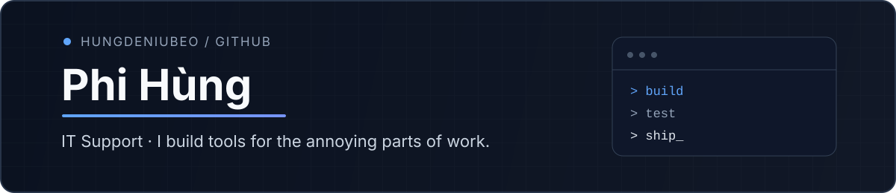

  

  <a href="https://hungdeniubeo.github.io/">Portfolio</a>
  &nbsp;·&nbsp;
  <a href="mailto:phihung3922@gmail.com">Email</a>
  &nbsp;·&nbsp;
  <a href="https://www.youtube.com/@phihung3922-t6f">YouTube</a>

## Hey.

I work in **IT Support**, and I like building software when a workflow starts getting annoying.

A lot of the things in this profile began with something small: too many repeated steps, a schedule that was painful to manage, a UI that could be clearer, or a process that should have been automated. I usually learn by fixing that problem first and figuring out the rest on the way.

These days I'm spending most of my time on **ScheduleWork**, web development, QA, and automation.

---

## What I'm working on

### [ScheduleWork Web](https://github.com/hungdeniubeo/Schedulework-Web)

The web version of my scheduling tool. Employees can submit availability, while admins can arrange shifts, review conflicts, publish schedules, and manage the weekly workflow in one place.

`React` `TypeScript` `Supabase` `PostgreSQL` `Vite`

[Live site](https://schedulework-web.vercel.app/) · [Source](https://github.com/hungdeniubeo/Schedulework-Web)

### [ScheduleWork Desktop](https://github.com/hungdeniubeo/Schedulework)

This is where ScheduleWork started: an offline desktop app for building weekly staff schedules without needing a server. It has drag-and-drop scheduling, conflict checks, split shifts, staffing totals, and export.

`Tauri` `React` `TypeScript` `Rust`

[Source](https://github.com/hungdeniubeo/Schedulework)

---

## Other things I've built

| Project | What it is | Stack |
| --- | --- | --- |
| [Traffic Sign Recognition](https://github.com/hungdeniubeo/Traffic-sign) | A CNN project for recognizing traffic signs from images and webcam input. | Python · TensorFlow · Keras · OpenCV |
| [Bus Booking](https://github.com/hungdeniubeo/Busbooking) | A full-stack booking app for routes, schedules, seats, and reservations. | React · Node.js · MySQL |
| [Personal Portfolio](https://hungdeniubeo.github.io/) | My small corner of the web for projects and experiments. | HTML · CSS · JavaScript |

<strong>More / older experiments</strong>

 

Not every repo here is meant to look production-ready. Some are old learning projects, some are experiments, and some are tools I built because I wanted to understand how something worked.

That mess is part of the process.

---

## Things I use a lot

**Frontend**  
`React` `TypeScript` `JavaScript` `HTML` `CSS` `Tailwind CSS` `Vite`

**Backend / data**  
`Node.js` `Java` `Spring Boot` `Python` `FastAPI` `PostgreSQL` `MySQL` `Supabase`

**Desktop / tooling**  
`Tauri` `Rust` `Git` `GitHub Actions` `Docker` `Postman`

**The less glamorous part**  
Debugging · manual testing · reproducing bugs · reading logs · figuring out why something only breaks on one machine

---

## Right now

- Making **ScheduleWork Web** feel less like a side project and more like something people can actually use every week.
- Getting better at backend architecture instead of only making the UI work.
- Spending more time on QA and edge cases before calling a feature “done”.
- Automating repetitive work whenever it makes sense.

---

## Find me

If you're here because of one of my projects, opening an issue is usually the easiest way to reach me.

For everything else:

**[hungdeniubeo.github.io](https://hungdeniubeo.github.io/)** · **[Email](mailto:phihung3922@gmail.com)** · **[GitHub](https://github.com/hungdeniubeo)** · **[YouTube](https://www.youtube.com/@phihung3922-t6f)**
