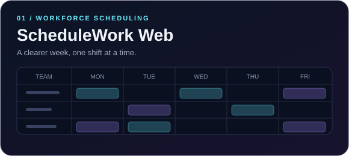
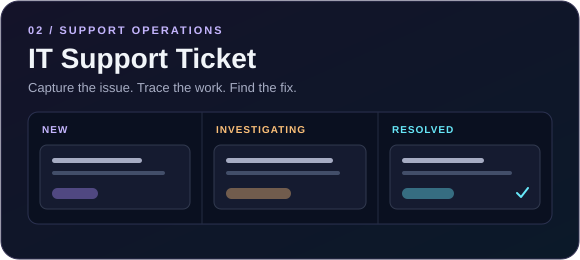

# PHI HÙNG

**IT Support · Web & Desktop Development**

I turn everyday work problems into useful software. 
Clean interfaces. Practical tools. Small details that make a difference.

[**Explore my work**](#selected-work) &nbsp; · &nbsp; [**My toolbox**](#toolbox) &nbsp; · &nbsp; [**Email me**](mailto:phihung3922@gmail.com)

## A little about me

I'm **Nguyễn Hà Phi Hùng**, a software developer based in Vietnam with a background in IT support. I like understanding where a workflow gets frustrating, then building something that makes it easier.

- **Building:** scheduling software and a personal IT support ticket system.
- **Designing:** compact, responsive interfaces with clear interactions.
- **Working across:** web apps, offline desktop tools, macOS, and Windows.

## Selected work

  
  

| Project | What I built | Stack |
| :--- | :--- | :--- |
| **[ScheduleWork Web](https://github.com/hungdeniubeo/Schedulework-Web)** | Employee shift registration, admin scheduling, conflict checks, and published weekly schedules. | React · TypeScript · Supabase |
| **[IT Support Ticket](https://github.com/hungdeniubeo/it-support-ticket)** | A personal helpdesk to track issues, investigations, root causes, solutions, and attachments. | React · TypeScript · Supabase |
| **[ScheduleWork Desktop](https://github.com/hungdeniubeo/Schedulework)** | An offline shift planner with drag-and-drop scheduling, conflict detection, and high-resolution JPG export. | Tauri · React · TypeScript · Rust |

<a href="https://github.com/hungdeniubeo?tab=repositories"><b>Browse all repositories →</b></a>

## Toolbox

| Where I work | What I use |
| :--- | :--- |
| **Interfaces** | `React` · `TypeScript` · `Vite` · `Tailwind CSS` |
| **Desktop applications** | `Tauri` · `Rust` |
| **Authentication & data** | `Supabase` · `PostgreSQL` |
| **Development workflow** | `Git` · `GitHub` · `GitHub Actions` · `VS Code` |

## GitHub activity

  

  
  

<picture>
  <source media="(prefers-color-scheme: dark)" srcset="https://raw.githubusercontent.com/hungdeniubeo/hungdeniubeo/output/github-contribution-grid-snake-dark.svg" />
  <source media="(prefers-color-scheme: light)" srcset="https://raw.githubusercontent.com/hungdeniubeo/hungdeniubeo/output/github-contribution-grid-snake.svg" />
  
</picture>

<b>View my contribution skyline in 3D</b>

  

<b>Design inspiration & credits</b>

Inspired by the personal branding and project presentation of [DenverCoder1](https://github.com/DenverCoder1/DenverCoder1) and [anuraghazra](https://github.com/anuraghazra/anuraghazra), and the contribution animation on [Platane's profile](https://github.com/Platane/Platane). The introduction, project descriptions, and project illustrations are customized for this profile.

Activity visuals: [GitHub Profile Summary Cards](https://github.com/vn7n24fzkq/github-profile-summary-cards), [snk](https://github.com/Platane/snk), and [GitHub Profile 3D Contrib](https://github.com/yoshi389111/github-profile-3d-contrib).

---

**Have a workflow that could be simpler? Let's talk.**

[phihung3922@gmail.com](mailto:phihung3922@gmail.com) &nbsp; · &nbsp; [GitHub](https://github.com/hungdeniubeo) &nbsp; · &nbsp; [Back to top ↑](#top)

Understand the problem. Build the tool. Refine the experience.

